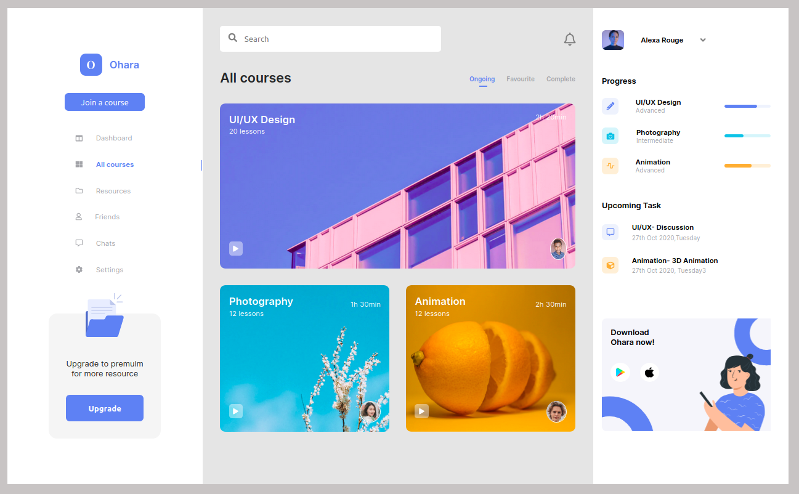

# ui-dashboard

This project was quite challenging. It was a milestone for me to take a design from Figma and implement it with code. I used Grid and flexbox to style the layout. 
It isn't mobile responsive because the design files only had the desktop version.

;

Here's the [Live Preview](https://ui-dashboard-1.netlify.app/)
